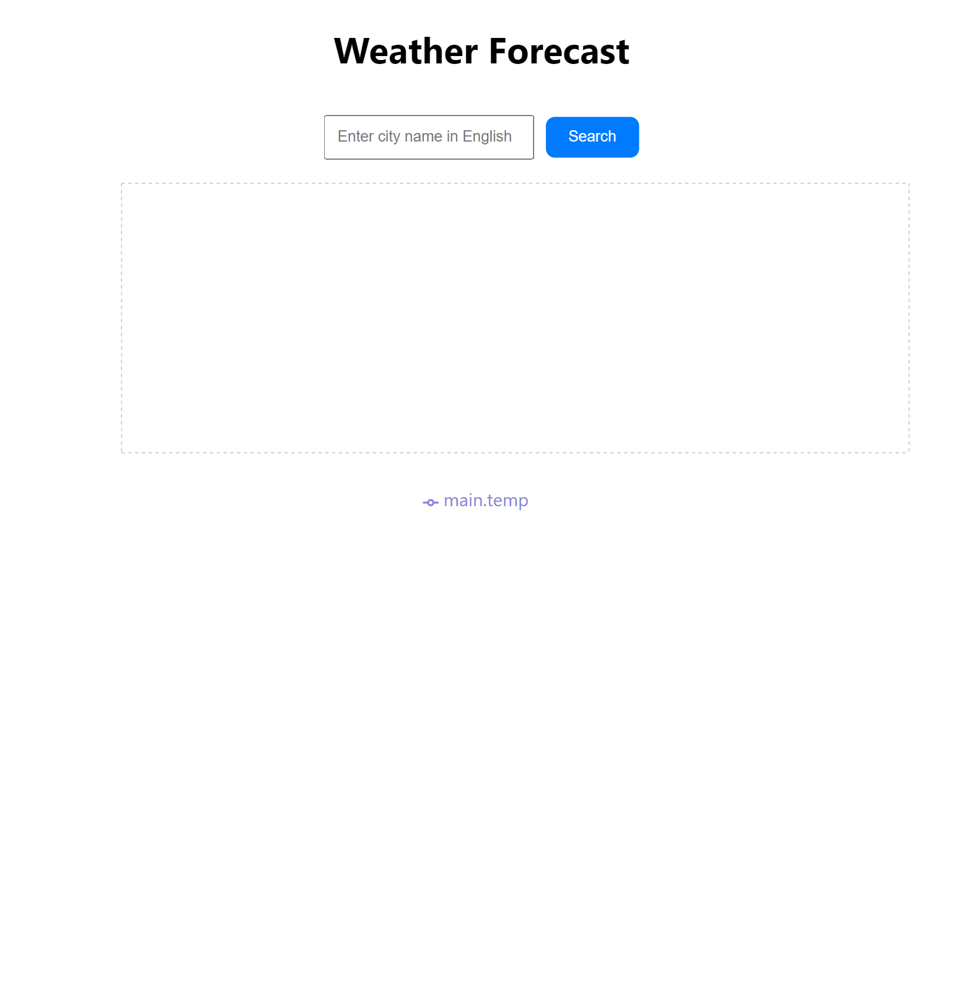
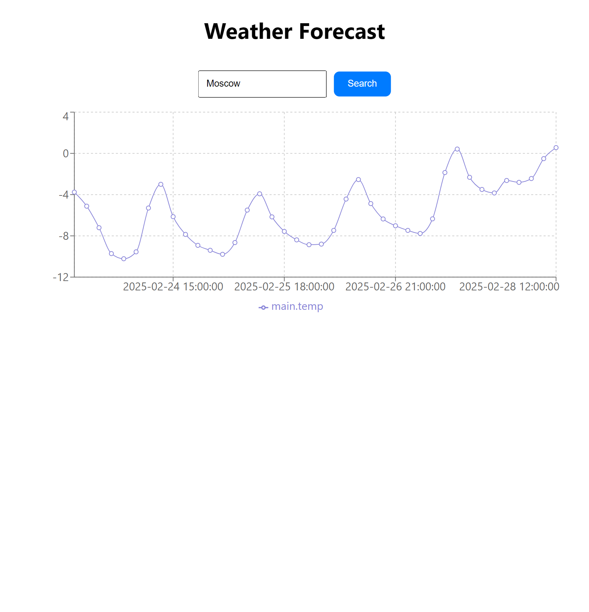

<h1 align="center">Weather Forecast</h1>

<h2>🚀 Techs</h2>

> - [React JS](https://reactjs.org/)
> - [TypeScript](https://www.typescriptlang.org/)
> - [styled-component](https://styled-components.com/)
> - [OpenWeather](https://openweathermap.org/api)

 

  
  

# Запуск проекта

- Клонировать репозиторий

  > git clone https://github.com/inacio000/Weather-Forecast

- Установить зависимости

  > npm install

  > cd weather-forecast
  > npm start

### [🔗Нажмите здесь, чтобы просмотреть сайт](https://weatherforecast-test.netlify.app/)
